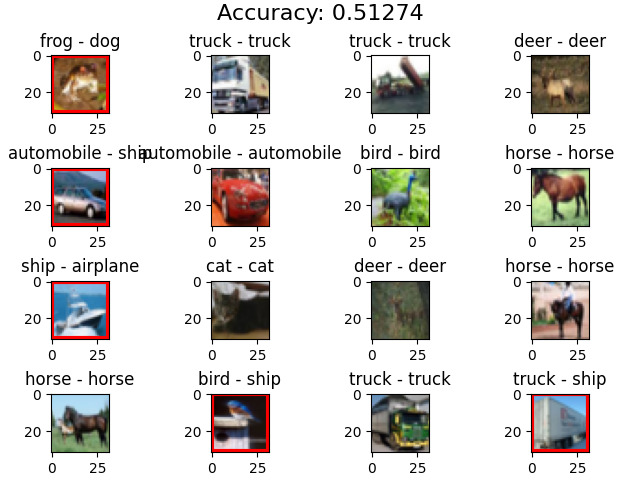

# SimSiam (PyTorch)
## Implementation of the SimSiam algorithm in PyTorch
SimSiam is a self-supervised learning algorithm that accepts (requires) unlabelled images and learns their features. The resulting policy is then decapitated and it's head is replaced and trained on a small labelled dataset (the downstream task). 

This package has been tested with the CIFAR10 dataset (60,000 images of size 32x32) and was able to get a downstream accuracy of ~52% using a ResNet50 encoder. 

  

## Optuna
I have also integrated an Optuna script for finding the optimal hyperparameters. Though this is still in the experimental phase.

## To-Do List
* Clean up code
* Ddd the ability to call the function inline that accepts arguments
* Clean Optuna
* Clean downstream script
